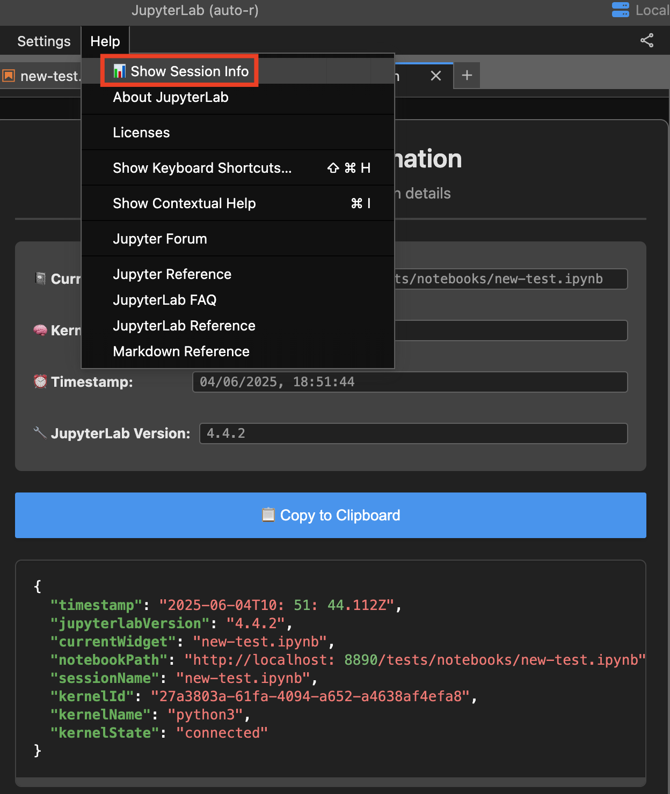

# Jupyter Session Tracer

A JupyterLab extension that displays session information in a beautiful popup with automatic clipboard copying.

[](https://badge.fury.io/py/jupyter-session-tracer)
[](https://github.com/wenmin-wu/jupyter-session-tracer/blob/main/LICENSE)

## Features

This extension adds a **📊 Show Session Info** option to the JupyterLab Help menu that displays comprehensive session information in a beautiful popup:

- **Current File**: The path of the currently active notebook
- **Kernel Information**: Kernel ID, name, and connection status  
- **Session Details**: Session name and timestamp
- **Notebook Path**: Full URL path to the current notebook
- **System Information**: JupyterLab version and timestamps
- **Auto-Copy**: Session data is automatically copied to clipboard with one-click copy button

## Screenshots

### Extension in Action

The screenshot below shows the complete workflow - accessing the extension through the Help menu and viewing the session information popup:



*The extension integrates into JupyterLab's Help menu with **📊 Show Session Info** and displays comprehensive session information in a professional popup with one-click clipboard copying.*

### Key Features Highlighted

- **📊 Menu Integration**: Cleanly integrated into JupyterLab's Help menu
- **📋 Copy Button**: Large, prominent blue button for easy clipboard access
- **🎨 Professional Design**: Clean layout with proper spacing and typography
- **📱 Responsive**: Works across different screen sizes and JupyterLab themes
- **⚡ Quick Access**: Keyboard shortcuts and command palette support

## What Information is Tracked

```json
{
  "timestamp": "2025-06-04T10:51:44.112Z",
  "jupyterlabVersion": "4.4.2", 
  "currentWidget": "new-test.ipynb",
  "notebookPath": "http://localhost:8890/tests/notebooks/new-test.ipynb",
  "sessionName": "new-test.ipynb",
  "kernelId": "27a3803a-61fa-4094-a652-a4638af4efa8",
  "kernelName": "python3",
  "kernelState": "connected"
}
```

## Installation

### From PyPI (Recommended)

```bash
pip install jupyter-session-tracer
```

### From Source

1. **Clone the repository:**
```bash
git clone https://github.com/wenmin-wu/jupyter-session-tracer.git
cd jupyter-session-tracer
```

2. **Install dependencies and build:**
```bash
pip install -e .
jupyter labextension develop . --overwrite
jlpm run build
```

### Prerequisites

- JupyterLab >= 4.0.0
- Python >= 3.8
- Node.js >= 18 and npm/yarn (for building)

## License

This project is licensed under the BSD 3-Clause License.

## Acknowledgments

This extension is based on the [JupyterLab extension examples](https://github.com/jupyterlab/extension-examples) repository and provides a user-friendly way to inspect and share session information. 

## Links

- **GitHub Repository**: https://github.com/wenmin-wu/jupyter-session-tracer
- **PyPI Package**: https://pypi.org/project/jupyter-session-tracer/
- **Issues & Bug Reports**: https://github.com/wenmin-wu/jupyter-session-tracer/issues
- **JupyterLab Extension Examples**: https://github.com/jupyterlab/extension-examples 